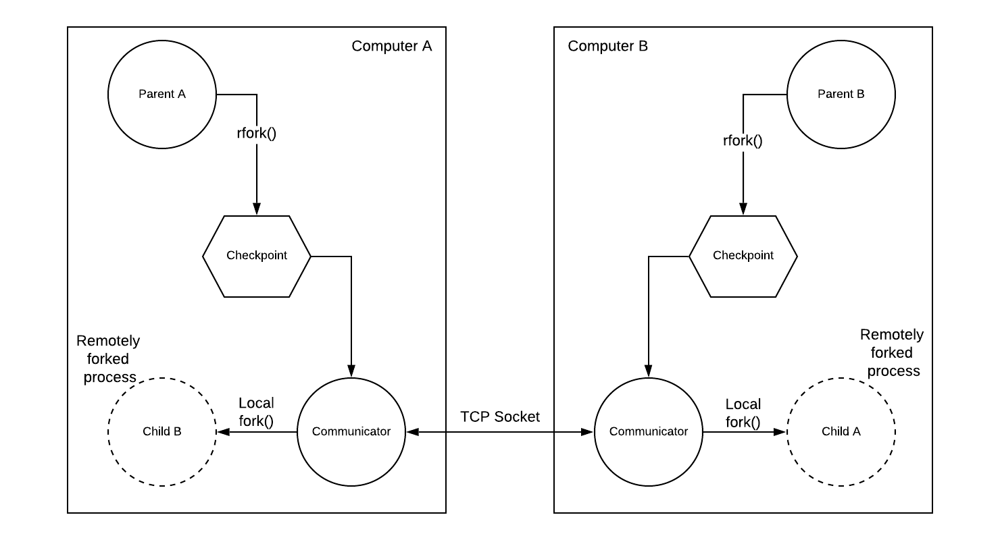

# remote-fork
Project repo for the implementation of remote fork system call. A remote fork [rfork()] is system call that is called by a parent process to create an identical child process in a remote host. When it is created, the child process must wake up executing the command following the system call directly.

We differentiate between parent and child processes after the rfork() system call through the Process ID (PID) number that is returned by rfork(). After rfork(), we check whether the PID is that of the parent in which case it should continue its execution unaffected. If it’s the PID of the child process it should carry on executing the program after the rfork() in the remote host. The work done by Smith and Ioannidis from Columbia University presents a way to achieve though the concept of checkpoints. Checkpoints can be viewed as “screenshots” of the state of the running program at some point of time. It is a file that contains information about the program current stack, program counter, running threads, etc at a given point of time. This file can be restarted at any point from any device, continuing the execution of the original parent program from the point in which the checkpoint (or screenshot) was taken. They do so by the following steps:

1. Store the state of the process into a file.
2. Copy the file to a remote system. One way we can do this is by using a remote copy command (e.g., rcp ). 
3. Restore the process from the file, at the remote system. 

Since step #2 can easily be accomplished, we sought to achieve the other two steps. Step #3 can only be accomplished by use of the exec() system call that will be invoked on the remote machine, as it is the only way to obtain a running copy of an image. Hence, step #1 must create the file in a format which exec() can use.

## Design Architecture
<p align="center">

</p>

## Implementation Details
rfork(): as previously mentioned the rfork() takes a checkpoint of the current state of the program, saves it locally on the computer drive, renames it so that it can be easily spotted and then the communicator handles the rest by sending this checkpoint to the remote device:
```
myfork::rfork()
{
int x = -2;
x = checkpoint();
return x;
}
```

Checkpointing: in order to make a checkpoint of the current state of the program at the remote fork system call, I used dmtcp library that already has an API that includes a dmtcp_checkpoint() method that creates a checkpoint of the program and returns an integer differentiating whether between the original file and its checkpoint. In case it is the original program it prints a string showing that is a parent, creates the checkpoint file, renames it, and leaves it to the communicator to be sent to the remote device. In case it is a restarted checkpoint (means that it is now running in the child), it prints a string showing that it is a child and continues program execution after calling rfork().


```
int myfork::checkpoint()
{
int x = -2;
if (dmtcp_is_enabled()) {
rr = dmtcp_checkpoint();
if (rr == DMTCP_NOT_PRESENT) {
x = -1;
printf("** Error, DMTCP not running; checkpoint skipped ** \n");
}
if (rr == DMTCP_AFTER_CHECKPOINT) {
rename_me();
printf("\n");
printf("** Parent remote forked here! \n");
x = 0;
}
if (rr == DMTCP_AFTER_RESTART) {
printf("** Child continuing after remote fork! \n");
x = 1;
}
} else {
printf(" dmtcp disabled -- nevermind\n");
}
return x;
}
```

Communication: as shown in the design architecture above, the communicator node is a node that handles communication between the two hosts both ways. It does so by creating TCP sockets between the two computers to send and receive checkpoint files. It is also important to mention that each communicator node includes a server and client in order to handle communication both ways. Both communicator nodes need to be continuously running in the background of each computer so that when any process forks at any point in time, it can be immediately sent to the other computer. Therefore the main of the communicator looks like this:

```
int main()
{
Client_socket client;
Server_socket server;
while (1) {
server.transmit_file();
sleep(5);
client.receive_file();
sleep(5);
}
return 0;
}
```

Restarting the checkpoint: This is the point where we actually create a child process in the remote host. The only way to create a new process is by using execv command in linux. This command overwrites the running program that called it with any valid executable. Therefore, when the communicator receives a checkpoint from the other computer it calls a local fork() to make a child copy of itself, which in turn calls execv to overwrite the child copy with the checkpoint file received from the remote parent. The part that does this in the communicator code goes as follows:

```
pid_t pid;
int ret = 1;
int status;
pid = fork();
if (pid == -1) {
// pid == -1 means error occured
printf("can't fork, error occured\n");
exit(EXIT_FAILURE);
} else if (pid == 0) {
printf("child process, pid = %u\n", getpid());
printf("parent of child process, pid = %u\n", getppid());
char *cmd = "dmtcp_restart";
char *argv[4];
argv[0] = "dmtcp_restart";
argv[1] = "--join";
argv[2] = "image.dmtcp";
argv[3] = NULL;
execvp(cmd, argv);
printf("Return not expected. Must be an execv error.n\n");
exit(0);
}
```

## How to run

A recorded video showing the steps needed to run the project on your machine:
https://drive.google.com/file/d/1zbSjYsOeUS8eRozafBYHTvCour142q8i/view?usp=sharing

The whole project is dockerized and available on docker hub:
https://hub.docker.com/repository/docker/osama2000/remote-fork

But first you need to install docker through this link:
https://docs.docker.com/engine/install/ubuntu/

Then run the following command through your terminal
```
Sudo docker pull osama2000/remote-fork:fork-me-tag
```

Then find the name and id of the docker image using:
```
Sudo docker images
```

Run a container of this image for computer A and enter its terminal using:
```
Sudo docker run -it <image-id>
```

Run another container for computer B and enter its terminal using
```
Sudo docker run -it <image-id>
```

Find the IDs and names of the running containers using:
```
Sudo docker ps
```

Run two more terminals of each container using
```
Sudo docker exec -it <container-id> bash
```
  
Run the dmtcp coordinator in a terminal of each of the two computers using
```
Dmtcp_coordinator
```

Run the communicator of both machines in a terminal in each:
```
./communicator.out
```

Finally, run a process on any of the two devices to test remote fork system call:
```
Dmtcp_launch --join ./run
```
